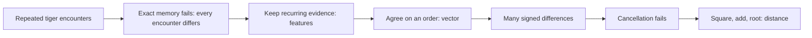
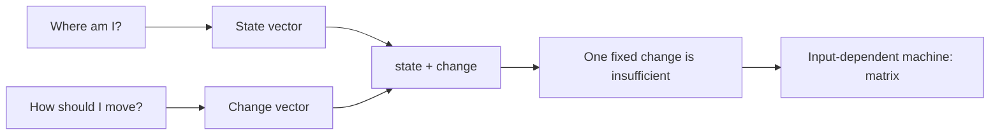
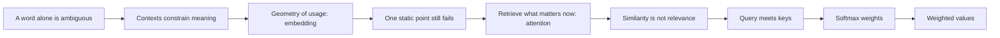
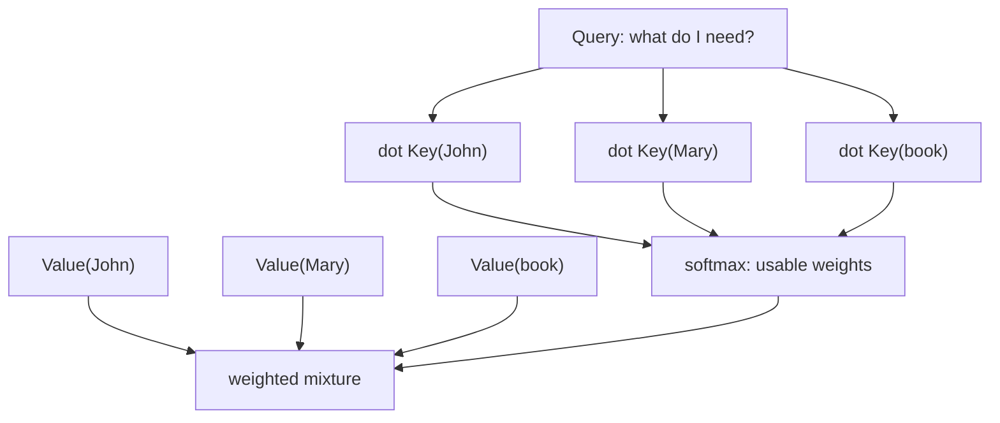
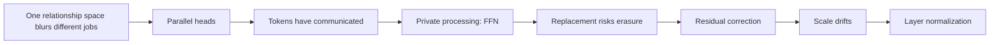
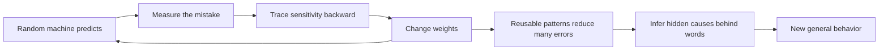

# Visual Field Guide

These diagrams do not summarize formulas. They show the pressure that creates each idea. Read the linked chapter first.

## 000–003 — Observation becomes measurable comparison

## 004–005 — Description becomes change

## 006–010 — Words become contextual retrieval

## One token asking the sentence for help

## 011–014 — One retrieval becomes a deep block

## 015–016 — Error becomes hidden structure

The full dependency is not a list of fashionable terms. It is a chain of unfinished problems: each right-hand box becomes inadequate and creates the next chapter.
