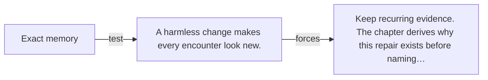

# Diagram — Excavation 000 — Before Mathematics Existed

The picture carries this excavation's particular counterexample and repair.



```text
TRY     Exact memory
BREAK   A harmless change makes every encounter look new.
REPAIR  Keep recurring evidence. The chapter derives why this repair exists before naming…
```

<!-- memory-film-v1:start -->
## Five-frame memory film

```text
QUESTION       How can one observation survive after every witness has gone?
     ↓
OBJECT         a fresh tiger track beside the tribe's first charcoal mark
     ↓
VISIBLE BREAK  Wind softens the track while two witnesses remember different animals.
     ↓
TRANSFORMATION A hand traces the track into clay; the animal can leave, but the shared mark remains.
     ↓
MEMORY SEAL    Mathematics begins when an observation receives a form that can outlive its observer.
```
<!-- memory-film-v1:end -->
