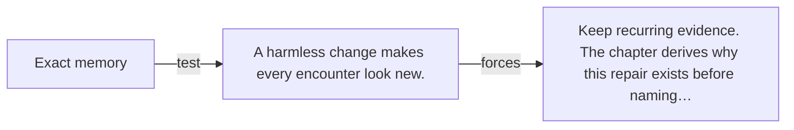

# Diagram — Excavation 000 — Before Mathematics Existed

The picture carries this excavation's particular counterexample and repair.



```text
TRY     Exact memory
BREAK   A harmless change makes every encounter look new.
REPAIR  Keep recurring evidence. The chapter derives why this repair exists before naming…
```
