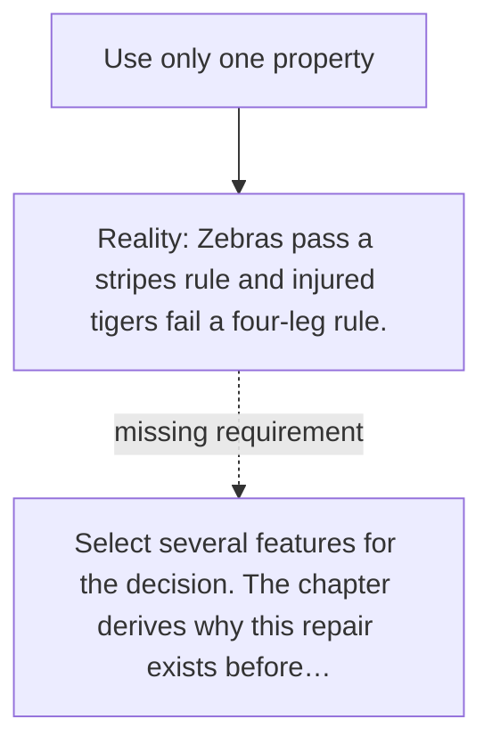

# Diagram — Excavation 001 — Why Features Exist

The picture carries this excavation's particular counterexample and repair.



```text
TRY     Use only one property
BREAK   Zebras pass a stripes rule and injured tigers fail a four-leg rule.
REPAIR  Select several features for the decision. The chapter derives why this repair exists before…
```
