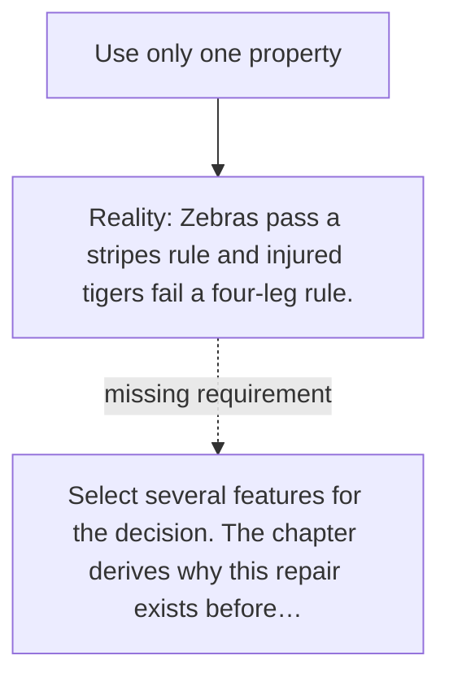

# Diagram — Excavation 001 — Why Features Exist

The picture carries this excavation's particular counterexample and repair.



```text
TRY     Use only one property
BREAK   Zebras pass a stripes rule and injured tigers fail a four-leg rule.
REPAIR  Select several features for the decision. The chapter derives why this repair exists before…
```

<!-- memory-film-v1:start -->
## Five-frame memory film

```text
QUESTION       Which parts of an animal must we preserve to judge whether it threatens the camp?
     ↓
OBJECT         five carved tiger tokens: weight, speed, teeth, stripes, and direction
     ↓
VISIBLE BREAK  A zebra passes the stripe test, while a three-legged tiger fails the four-leg test.
     ↓
TRANSFORMATION The tokens separate, and only observations relevant to the danger decision remain on the table.
     ↓
MEMORY SEAL    A feature is a chosen observation that preserves a distinction needed by a question.
```
<!-- memory-film-v1:end -->
