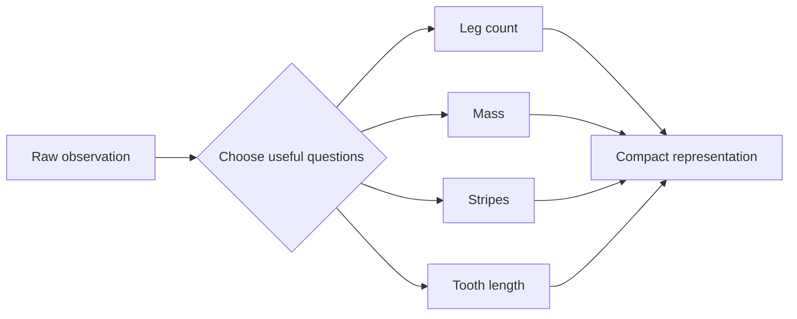

# Diagrams — Why Features Exist

```mermaid
flowchart LR
    A[Raw observation] --> B{Choose useful questions}
    B --> C[Leg count]
    B --> D[Mass]
    B --> E[Stripes]
    B --> F[Tooth length]
    C & D & E & F --> G[Compact representation]
```

Information excluded during feature selection cannot be recovered later.
