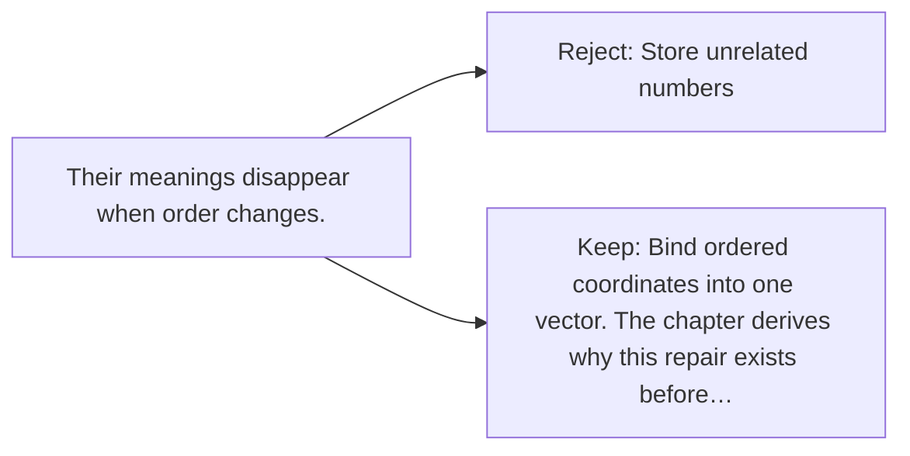

# Diagram — Excavation 002 — Vectors

The picture carries this excavation's particular counterexample and repair.



```text
TRY     Store unrelated numbers
BREAK   Their meanings disappear when order changes.
REPAIR  Bind ordered coordinates into one vector. The chapter derives why this repair exists before…
```

<!-- memory-film-v1:start -->
## Five-frame memory film

```text
QUESTION       How can many comparable features travel as one object without losing which is which?
     ↓
OBJECT         an ordered leather satchel with one pocket for each tiger feature
     ↓
VISIBLE BREAK  Loose measurement stones spill together; weight can no longer be distinguished from speed.
     ↓
TRANSFORMATION The stones slide into named pockets whose order remains fixed for every animal.
     ↓
MEMORY SEAL    A vector lets several measurements travel together while their positions preserve meaning.
```
<!-- memory-film-v1:end -->
