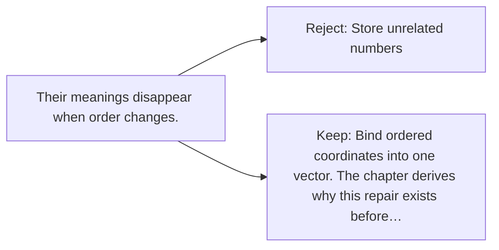

# Diagram — Excavation 002 — Vectors

The picture carries this excavation's particular counterexample and repair.



```text
TRY     Store unrelated numbers
BREAK   Their meanings disappear when order changes.
REPAIR  Bind ordered coordinates into one vector. The chapter derives why this repair exists before…
```
