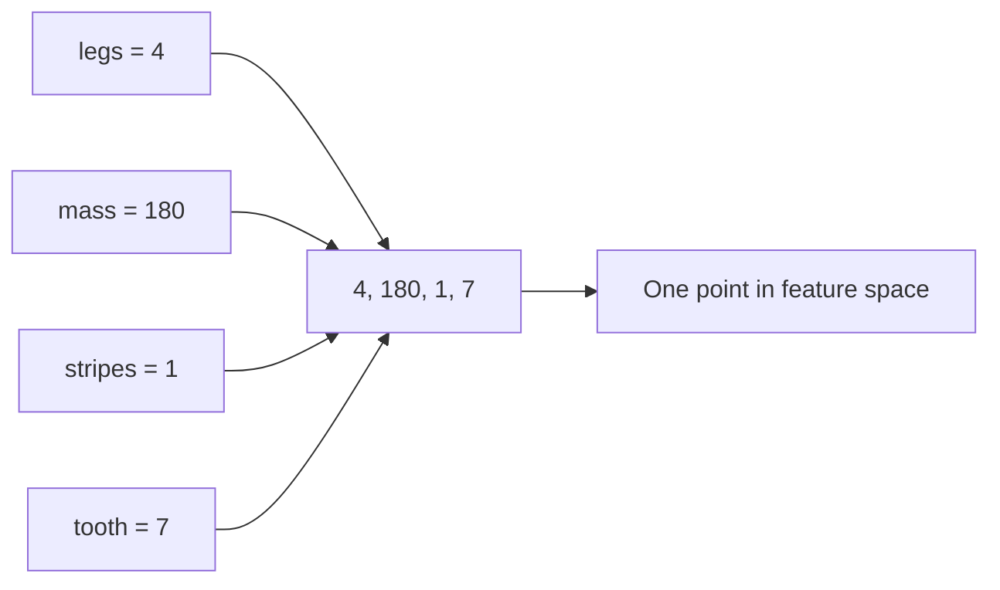

# Diagrams — Vectors

```mermaid
flowchart LR
    A[legs = 4] --> E[4, 180, 1, 7]
    B[mass = 180] --> E
    C[stripes = 1] --> E
    D[tooth = 7] --> E
    E --> F[One point in feature space]
```
