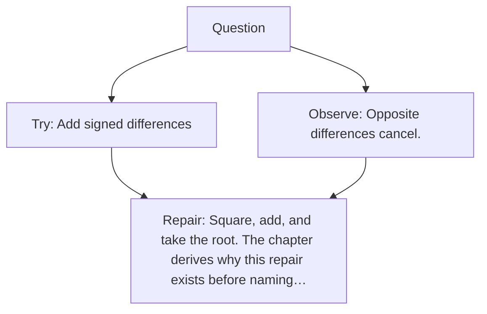

# Diagram — Excavation 003 — Distance

The picture carries this excavation's particular counterexample and repair.



```text
TRY     Add signed differences
BREAK   Opposite differences cancel.
REPAIR  Square, add, and take the root. The chapter derives why this repair exists before naming…
```
