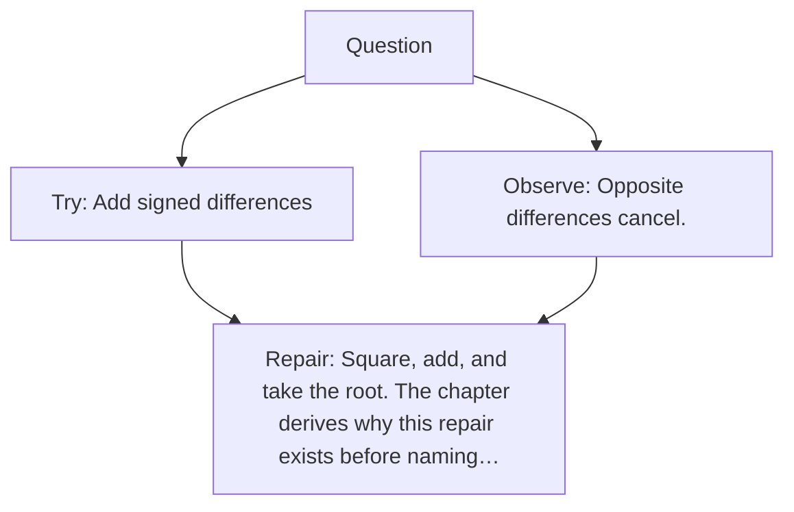

# Diagram — Excavation 003 — Distance

The picture carries this excavation's particular counterexample and repair.



```text
TRY     Add signed differences
BREAK   Opposite differences cancel.
REPAIR  Square, add, and take the root. The chapter derives why this repair exists before naming…
```

<!-- memory-film-v1:start -->
## Five-frame memory film

```text
QUESTION       How can the tribe turn many feature disagreements into one honest separation?
     ↓
OBJECT         two tiger silhouettes joined by feature-length measuring cords
     ↓
VISIBLE BREAK  Positive and negative disagreements pull opposite ways and cancel, making different animals appear identical.
     ↓
TRANSFORMATION Every cord's disagreement becomes nonnegative before the cords combine into one path between the animals.
     ↓
MEMORY SEAL    Distance is the single separation left after every comparable disagreement has been allowed to count.
```
<!-- memory-film-v1:end -->
