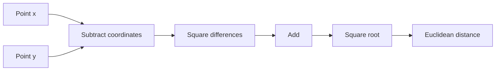

# Diagrams — Distance

```mermaid
flowchart LR
    X[Point x] --> S[Subtract coordinates]
    Y[Point y] --> S
    S --> Q[Square differences]
    Q --> A[Add]
    A --> R[Square root]
    R --> D[Euclidean distance]
```
