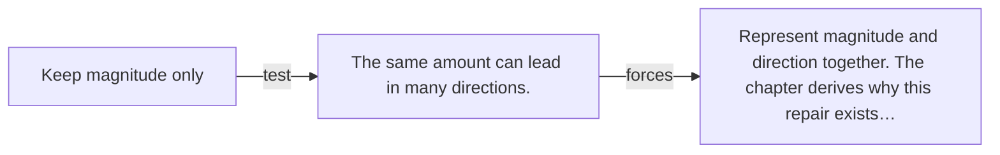

# Diagram — Excavation 004 — Vectors as Change

The picture carries this excavation's particular counterexample and repair.



```text
TRY     Keep magnitude only
BREAK   The same amount can lead in many directions.
REPAIR  Represent magnitude and direction together. The chapter derives why this repair exists…
```

<!-- memory-film-v1:start -->
## Five-frame memory film

```text
QUESTION       How can a vector describe not only what exists, but what changed?
     ↓
OBJECT         an arrow laid from yesterday's tiger position to today's
     ↓
VISIBLE BREAK  Two isolated position stones reveal locations but hide the movement connecting them.
     ↓
TRANSFORMATION The stones remain while a directed arrow grows from the earlier position to the later one.
     ↓
MEMORY SEAL    A change vector remembers both how far the world moved and in which direction.
```
<!-- memory-film-v1:end -->
