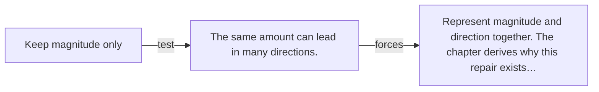

# Diagram — Excavation 004 — Vectors as Change

The picture carries this excavation's particular counterexample and repair.



```text
TRY     Keep magnitude only
BREAK   The same amount can lead in many directions.
REPAIR  Represent magnitude and direction together. The chapter derives why this repair exists…
```
