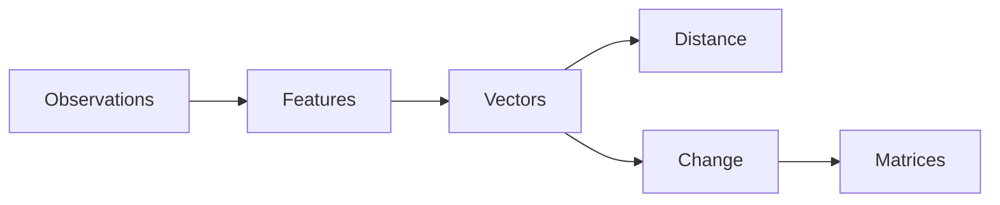

# Excavation 005 — Matrices

## The Problem: One Output Needs Many Inputs

Suppose a house vector is `[area, bedrooms, age]`. We want two new measurements:

- a size score combining area and bedrooms;
- a renovation score that increases with age but also depends on size.

Writing a special formula for every output works briefly, but a learning system may need thousands of inputs and outputs. We need a compact object containing many reusable recipes.

## One Row, One Question

Take an input:

$$\mathbf{x}=[4,5]$$

and a row of weights:

$$\mathbf{w}=[2,3]$$

Their dot product is:

$$
\mathbf{w}\cdot\mathbf{x}=2(4)+3(5)=23
$$

The row asks a weighted question: “What is twice the first feature plus three times the second?”

## The Invention: Stack the Questions

Place several rows together:

$$
A=\begin{bmatrix}2&0\\0&3\\1&1\end{bmatrix},
\quad
\mathbf{x}=\begin{bmatrix}4\\5\end{bmatrix}
$$

Each row produces one output:

$$
A\mathbf{x}=
\begin{bmatrix}
2(4)+0(5)\\
0(4)+3(5)\\
1(4)+1(5)
\end{bmatrix}
=
\begin{bmatrix}8\\15\\9\end{bmatrix}
$$

A **matrix** is a stack of feature-making recipes. Two inputs became three outputs.

## Why the Shapes Must Match

An $m\times n$ matrix consumes an $n$-dimensional vector and produces an $m$-dimensional vector:

$$
(m\times n)(n\times1)=(m\times1)
$$

The inner dimensions match because every row needs one weight per input feature. Shape errors are not arbitrary programming restrictions; they reveal an incomplete mathematical question.

## Columns Reveal the Transformation

There is another view. The first column tells where the basis vector `[1, 0]` goes; the second tells where `[0, 1]` goes. Since every input is a combination of basis vectors, the columns determine what happens to every input.

For example:

$$
R=\begin{bmatrix}0&-1\\1&0\end{bmatrix}
$$

sends `[1, 0]` to `[0, 1]` and `[0, 1]` to `[-1, 0]`: a 90-degree rotation.

## Failed Attempt: Transform Each Example by Hand

We could memorize a desired output for every input. That fails on unseen vectors. A matrix instead defines one rule that generalizes to infinitely many inputs and preserves linear structure:

$$A(\mathbf{x}+\mathbf{y})=A\mathbf{x}+A\mathbf{y}$$

The rule is limited—pure matrices cannot create curves or thresholds—but its consistency makes it composable and learnable.

## Composition and Order

Scale a point and then rotate it. If $S$ scales and $R$ rotates, the combined operation is:

$$R(S\mathbf{x})=(RS)\mathbf{x}$$

The rightmost transformation acts first. Usually $RS\neq SR$: stretching horizontally and then rotating is not the same as rotating first and then stretching horizontally.

## Why Neural Networks Depend on Matrices

A neural layer begins with a transformation such as:

$$\mathbf{y}=W\mathbf{x}+\mathbf{b}$$

Each row of $W$ learns a different weighted combination of input features. The bias $\mathbf{b}$ shifts the result. A nonlinearity, introduced later, lets stacked layers escape the limitations of purely linear transformations.

Training does not invent a new kind of arithmetic. It searches for useful entries of $W$ and $\mathbf{b}$.

## Code Walkthrough

`implementation.py` implements matrix-vector multiplication as one dot product per row. `transpose` turns the second matrix's columns into iterable rows. `matrix_matrix` then computes every row-column dot product.

Run:

```bash
python3 excavations/005-matrices/implementation.py
```

The program scales `[2, 1]` to `[4, 3]`, rotates it to `[-3, 4]`, and constructs the one matrix that performs both actions. Verify the composed matrix by hand.

## Common Misconceptions

**“A matrix is just a spreadsheet of numbers.”** Its arrangement encodes a mapping between spaces; rows and columns have distinct roles.

**“Matrix multiplication should be coordinate-wise.”** Coordinate-wise multiplication cannot compose linear transformations.

**“More layers of matrices automatically create complexity.”** Without nonlinear operations, many matrix layers collapse into one matrix.

## What We Unearthed

Part I began with raw experience and discovered a chain of necessity:



We can represent and transform measurable things. Next we try something less tangible: meaning.

---

Previous: [004 — Vectors as Change](../004-vectors-as-change/README.md) · Next: [006 — Meaning](../006-meaning/README.md)
