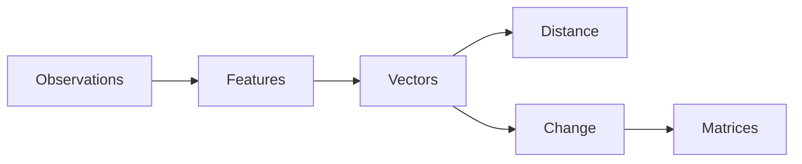

# Excavation 005 — Matrices

## The Problem

We can add or scale a vector, but real transformations coordinate many changes at once. How can we rotate a point, combine features, or convert an input into a new representation using one reusable rule?

## The Invention

A **matrix** is a rectangular grid of numbers. Multiplying it by a vector produces a new vector:

$$
\mathbf{y} = A\mathbf{x}
$$

Each row asks a weighted question about the input. For

$$
A = \begin{bmatrix}2 & 0 \\ 0 & 3\end{bmatrix},
\quad \mathbf{x} = \begin{bmatrix}4 \\ 5\end{bmatrix},
$$

the result is $[8, 15]$: the first dimension doubles and the second triples.

## Rows as Feature Makers

A row such as `[0.7, 0.2, -0.5]` combines three input features into one output feature. A matrix stacks several such recipes, producing several new features at once.

## Columns as Destinations

The columns reveal where each input basis direction moves. Together, they completely describe a linear transformation. This is why matrices can scale, rotate, reflect, project, and mix dimensions.

## Composition

Applying matrix $A$ and then $B$ is itself one transformation, represented by $BA$. Matrix multiplication is therefore the algebra of composing transformations. Order matters: $BA$ usually differs from $AB$.

## Why AI Needs This

A neural-network layer repeatedly performs a matrix transformation followed by a nonlinearity. The values in the matrix become learnable parameters. Training will eventually teach the matrix which feature combinations are useful.

## What We Unearthed

Part I began with raw observations and discovered a chain of necessity:

We can now represent and transform the world. Next we ask how a vector can represent something less visible: meaning.

---

Previous: [004 — Vectors as Change](../004-vectors-as-change/README.md) · Next: Excavation 006 — Meaning *(coming next)*
