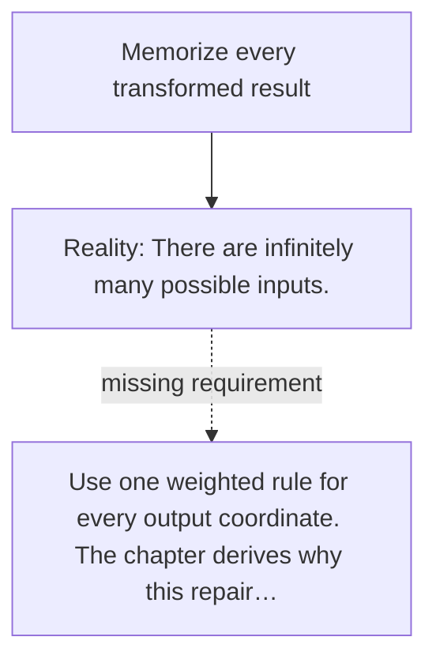

# Diagram — Excavation 005 — Matrices

The picture carries this excavation's particular counterexample and repair.



```text
TRY     Memorize every transformed result
BREAK   There are infinitely many possible inputs.
REPAIR  Use one weighted rule for every output coordinate. The chapter derives why this repair…
```

<!-- memory-film-v1:start -->
## Five-frame memory film

```text
QUESTION       How can many output judgments reuse the same collection of input features?
     ↓
OBJECT         a brass grid whose rows are judges and columns are tiger features
     ↓
VISIBLE BREAK  Separate handwritten rules repeatedly fetch the same features and silently change their ordering.
     ↓
TRANSFORMATION The rules lock into one grid; each row combines the same ordered input into one named output.
     ↓
MEMORY SEAL    A matrix is a reusable arrangement of transformations that lets inputs interact consistently.
```
<!-- memory-film-v1:end -->
