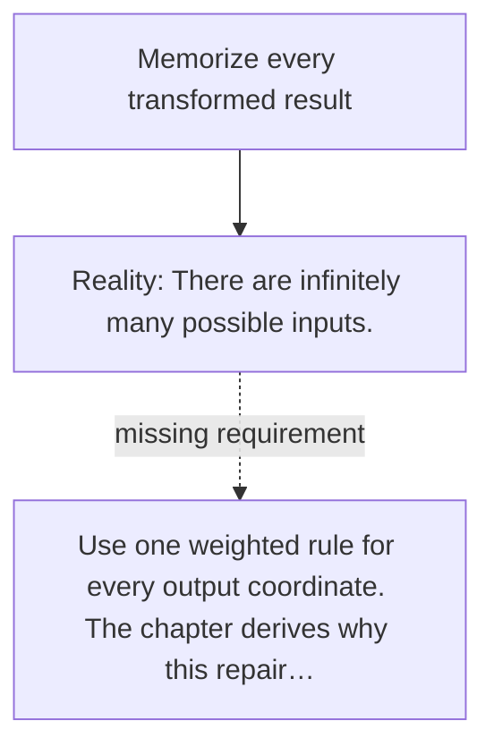

# Diagram — Excavation 005 — Matrices

The picture carries this excavation's particular counterexample and repair.



```text
TRY     Memorize every transformed result
BREAK   There are infinitely many possible inputs.
REPAIR  Use one weighted rule for every output coordinate. The chapter derives why this repair…
```
