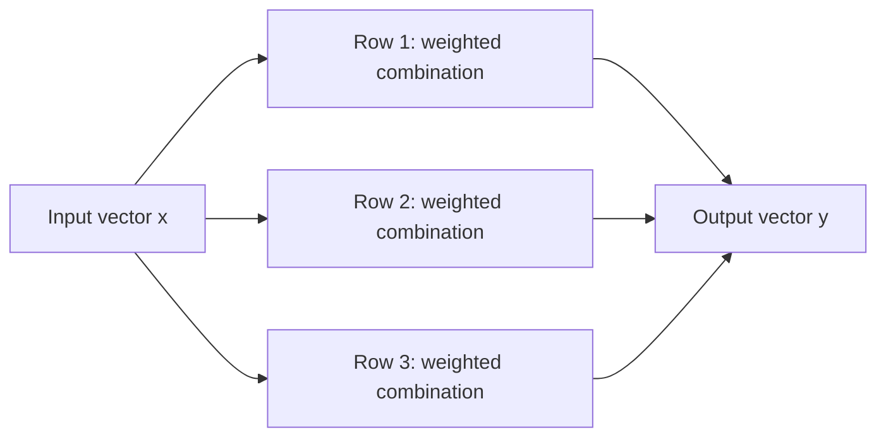

# Diagrams — Matrices

## A Matrix as a Feature Factory

```mermaid
flowchart LR
    X[Input vector x] --> R1[Row 1: weighted combination]
    X --> R2[Row 2: weighted combination]
    X --> R3[Row 3: weighted combination]
    R1 & R2 & R3 --> Y[Output vector y]
```

## Composing Transformations

```mermaid
flowchart LR
    X[x] -->|A| AX[Ax]
    AX -->|B| BAX[BAx]
    X -. equivalent .->|BA| BAX
```
