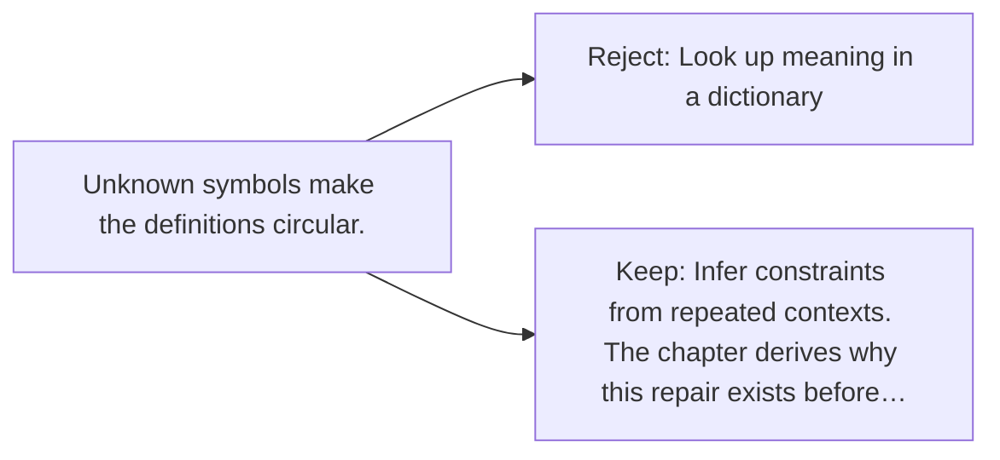

# Diagram — Excavation 006 — Meaning Without a Dictionary

The picture carries this excavation's particular counterexample and repair.



```text
TRY     Look up meaning in a dictionary
BREAK   Unknown symbols make the definitions circular.
REPAIR  Infer constraints from repeated contexts. The chapter derives why this repair exists before…
```

<!-- memory-film-v1:start -->
## Five-frame memory film

```text
QUESTION       If a dictionary cannot contain every use of a word, where does meaning come from?
     ↓
OBJECT         the word tiger suspended in a web of neighboring word-threads
     ↓
VISIBLE BREAK  Cutting tiger from its sentences leaves a label whose living uses have disappeared.
     ↓
TRANSFORMATION Threads reconnect it to hunt, stripes, jungle, fear, and many contrasting contexts.
     ↓
MEMORY SEAL    Meaning is not hidden inside a word; it is constrained by the relationships in which the word participates.
```
<!-- memory-film-v1:end -->
