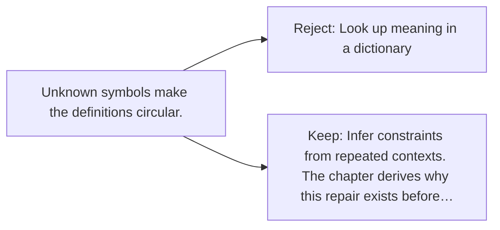

# Diagram — Excavation 006 — Meaning Without a Dictionary

The picture carries this excavation's particular counterexample and repair.



```text
TRY     Look up meaning in a dictionary
BREAK   Unknown symbols make the definitions circular.
REPAIR  Infer constraints from repeated contexts. The chapter derives why this repair exists before…
```
