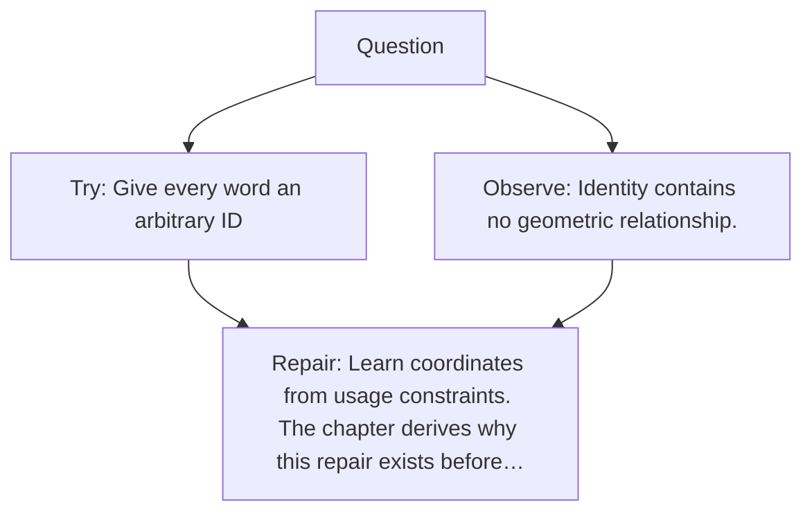

# Diagram — Excavation 007 — A Place for Meaning to Live

The picture carries this excavation's particular counterexample and repair.



```text
TRY     Give every word an arbitrary ID
BREAK   Identity contains no geometric relationship.
REPAIR  Learn coordinates from usage constraints. The chapter derives why this repair exists before…
```
