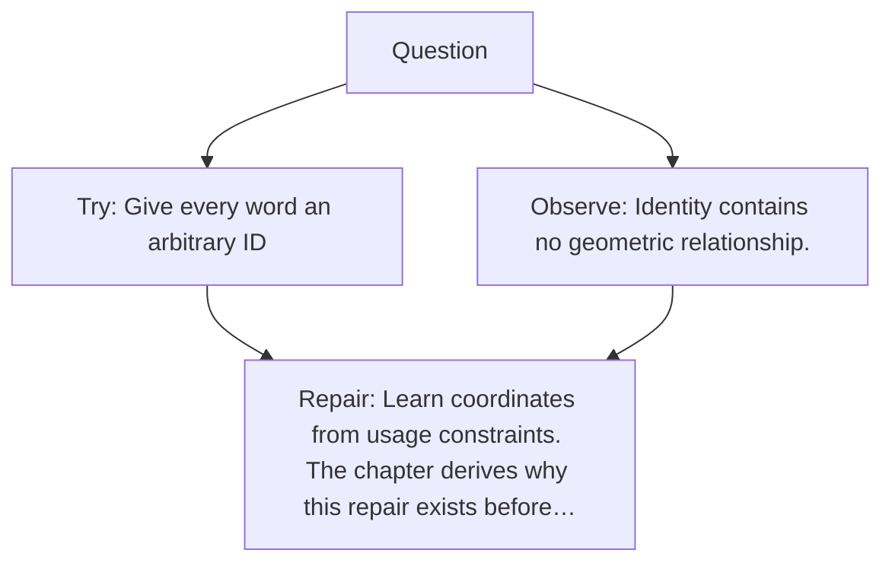

# Diagram — Excavation 007 — A Place for Meaning to Live

The picture carries this excavation's particular counterexample and repair.



```text
TRY     Give every word an arbitrary ID
BREAK   Identity contains no geometric relationship.
REPAIR  Learn coordinates from usage constraints. The chapter derives why this repair exists before…
```

<!-- memory-film-v1:start -->
## Five-frame memory film

```text
QUESTION       How can a machine give that web of meaning a place where relationships can move?
     ↓
OBJECT         a constellation in which tiger and lion stars can drift nearer while tiger and bicycle drift apart
     ↓
VISIBLE BREAK  Private one-hot pedestals keep every word equally far from every other word.
     ↓
TRANSFORMATION The pedestals dissolve and training moves stars through a shared geometric sky.
     ↓
MEMORY SEAL    An embedding is a learned place where useful relationships become available as geometry.
```
<!-- memory-film-v1:end -->
