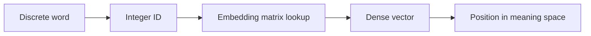

# Diagrams — Embeddings

```mermaid
flowchart LR
    W[Discrete word] --> I[Integer ID]
    I --> L[Embedding matrix lookup]
    L --> V[Dense vector]
    V --> G[Position in meaning space]
```

Nearby locations represent similarity learned from the training objective and data.
