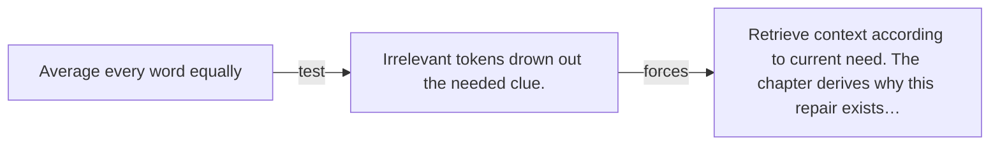

# Diagram — Excavation 008 — Why Attention Had to Exist

The picture carries this excavation's particular counterexample and repair.



```text
TRY     Average every word equally
BREAK   Irrelevant tokens drown out the needed clue.
REPAIR  Retrieve context according to current need. The chapter derives why this repair exists…
```

<!-- memory-film-v1:start -->
## Five-frame memory film

```text
QUESTION       When a word is surrounded by many others, how can it retrieve only what matters now?
     ↓
OBJECT         a movable lantern above a sentence carved around a circular table
     ↓
VISIBLE BREAK  One fixed summary blends river, animal, and action until the word bank cannot choose its active meaning.
     ↓
TRANSFORMATION The lantern sends a different beam from each word toward the contextual clues relevant to this occurrence.
     ↓
MEMORY SEAL    Attention lets each occurrence gather the evidence that matters to its present question.
```
<!-- memory-film-v1:end -->
