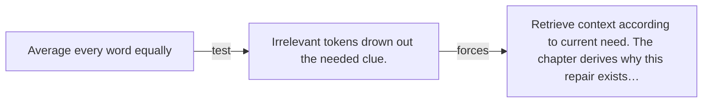

# Diagram — Excavation 008 — Why Attention Had to Exist

The picture carries this excavation's particular counterexample and repair.



```text
TRY     Average every word equally
BREAK   Irrelevant tokens drown out the needed clue.
REPAIR  Retrieve context according to current need. The chapter derives why this repair exists…
```
