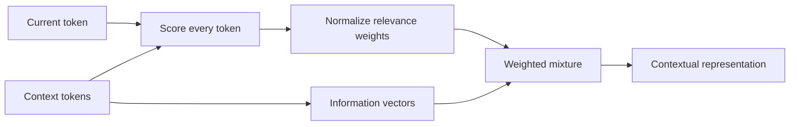

# Diagrams — Attention

```mermaid
flowchart LR
    T[Current token] --> S[Score every token]
    C[Context tokens] --> S
    S --> W[Normalize relevance weights]
    C --> V[Information vectors]
    W --> M[Weighted mixture]
    V --> M
    M --> O[Contextual representation]
```
