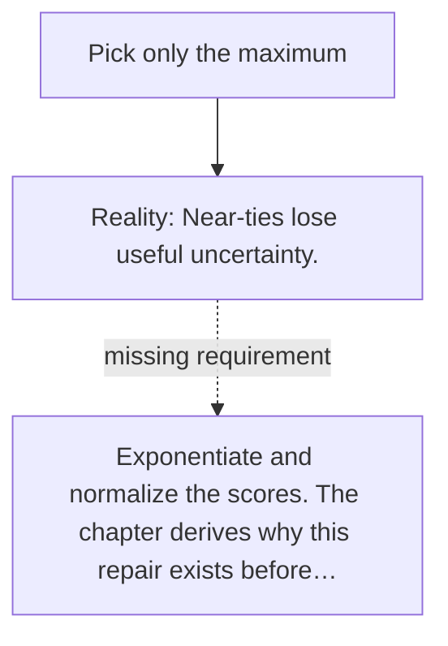

# Diagram — Excavation 009 — From Scores to Attention

The picture carries this excavation's particular counterexample and repair.



```text
TRY     Pick only the maximum
BREAK   Near-ties lose useful uncertainty.
REPAIR  Exponentiate and normalize the scores. The chapter derives why this repair exists before…
```
