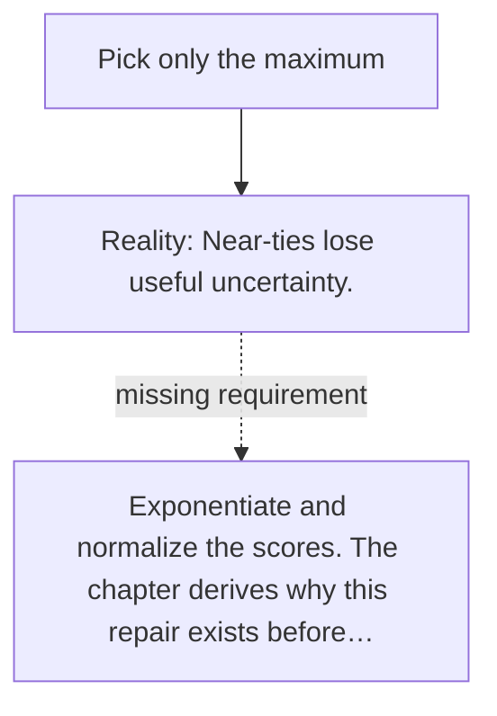

# Diagram — Excavation 009 — From Scores to Attention

The picture carries this excavation's particular counterexample and repair.



```text
TRY     Pick only the maximum
BREAK   Near-ties lose useful uncertainty.
REPAIR  Exponentiate and normalize the scores. The chapter derives why this repair exists before…
```

<!-- memory-film-v1:start -->
## Five-frame memory film

```text
QUESTION       How can raw relevance scores become shares that are positive and together form one whole?
     ↓
OBJECT         three attention bowls receiving water from scored channels
     ↓
VISIBLE BREAK  Raw scores include negatives and arbitrary scales, so they cannot say how much of the single vessel each clue receives.
     ↓
TRANSFORMATION Every channel becomes positive, then the common vessel divides the water into comparable shares summing to one.
     ↓
MEMORY SEAL    Softmax turns competing scores into a conserved distribution of attention.
```
<!-- memory-film-v1:end -->
