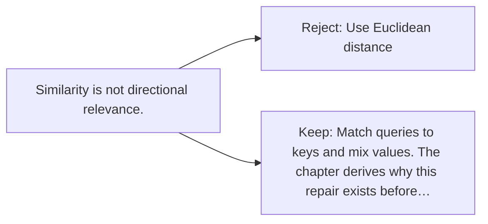

# Diagram — Excavation 010 — Query, Key, and Value

The picture carries this excavation's particular counterexample and repair.



```text
TRY     Use Euclidean distance
BREAK   Similarity is not directional relevance.
REPAIR  Match queries to keys and mix values. The chapter derives why this repair exists before…
```

<!-- memory-film-v1:start -->
## Five-frame memory film

```text
QUESTION       Why must asking, matching, and contributing be three different jobs?
     ↓
OBJECT         three masks labeled query, key, and value hanging above one word
     ↓
VISIBLE BREAK  Using one description for every job confuses what is sought, how relevance is tested, and what information is finally carried.
     ↓
TRANSFORMATION The word passes through three masks: one asks, one advertises, and one contributes.
     ↓
MEMORY SEAL    Query, key, and value separate the question, the match, and the knowledge that travels.
```
<!-- memory-film-v1:end -->
