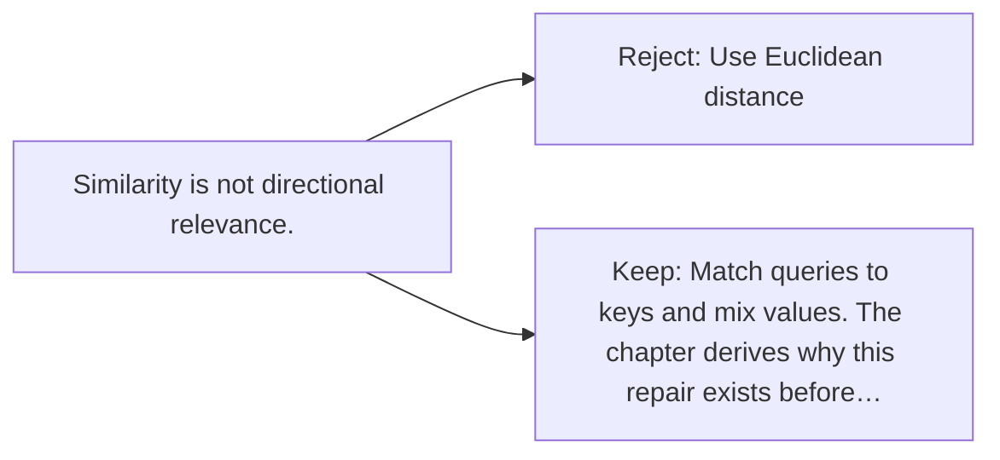

# Diagram — Excavation 010 — Query, Key, and Value

The picture carries this excavation's particular counterexample and repair.



```text
TRY     Use Euclidean distance
BREAK   Similarity is not directional relevance.
REPAIR  Match queries to keys and mix values. The chapter derives why this repair exists before…
```
