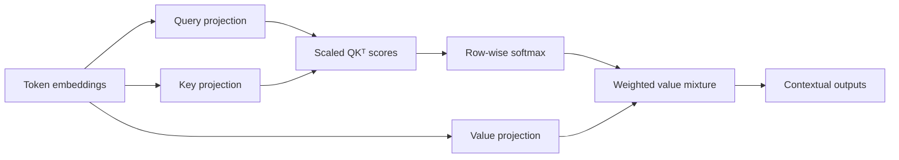

# Diagrams — Query, Key, Value

```mermaid
flowchart LR
    X[Token embeddings] --> Q[Query projection]
    X --> K[Key projection]
    X --> V[Value projection]
    Q --> S[Scaled QKᵀ scores]
    K --> S
    S --> W[Row-wise softmax]
    W --> O[Weighted value mixture]
    V --> O
    O --> C[Contextual outputs]
```

Queries and keys determine where information flows; values determine what information flows.
