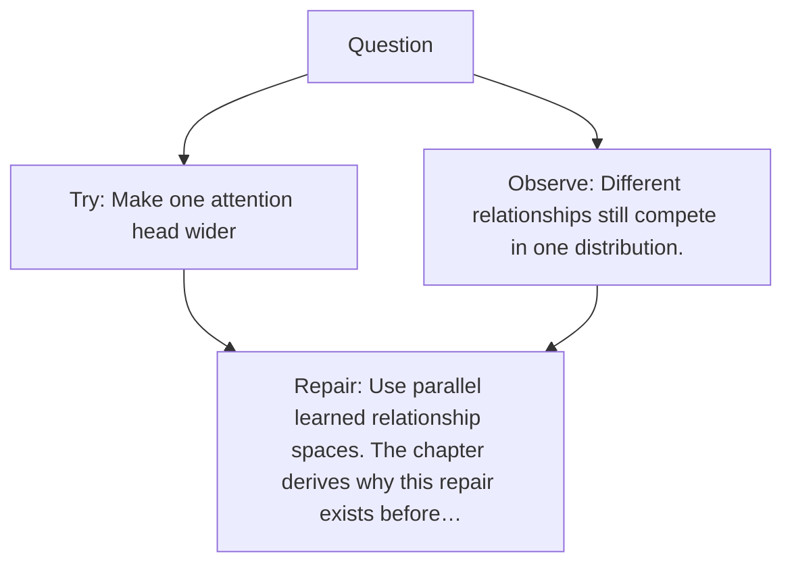

# Diagram — Excavation 011 — Multi-Head Attention

The picture carries this excavation's particular counterexample and repair.



```text
TRY     Make one attention head wider
BREAK   Different relationships still compete in one distribution.
REPAIR  Use parallel learned relationship spaces. The chapter derives why this repair exists before…
```

<!-- memory-film-v1:start -->
## Five-frame memory film

```text
QUESTION       What if understanding one word requires several kinds of relevance at once?
     ↓
OBJECT         a many-windowed observatory aimed at the same sentence
     ↓
VISIBLE BREAK  One attention beam must choose between syntax, identity, position, and reference, flattening different relationships into one compromise.
     ↓
TRANSFORMATION Several windows open; each follows one kind of relationship before their views reunite.
     ↓
MEMORY SEAL    Multi-head attention lets several relational questions be asked in parallel before their answers meet.
```
<!-- memory-film-v1:end -->
