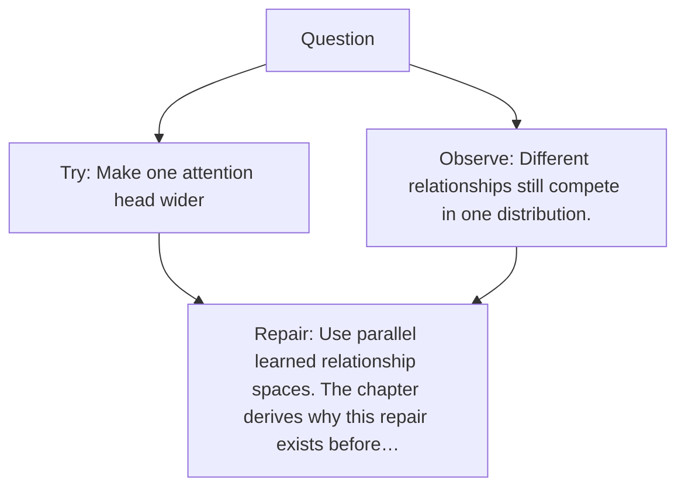

# Diagram — Excavation 011 — Multi-Head Attention

The picture carries this excavation's particular counterexample and repair.



```text
TRY     Make one attention head wider
BREAK   Different relationships still compete in one distribution.
REPAIR  Use parallel learned relationship spaces. The chapter derives why this repair exists before…
```
