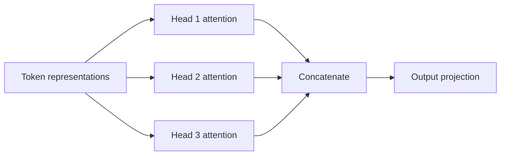

# Diagrams — Multi-Head Attention

```mermaid
flowchart LR
 X[Token representations] --> H1[Head 1 attention]
 X --> H2[Head 2 attention]
 X --> H3[Head 3 attention]
 H1 & H2 & H3 --> C[Concatenate]
 C --> O[Output projection]
```
