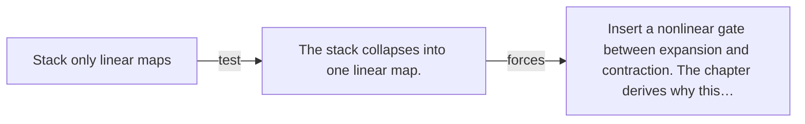

# Diagram — Excavation 012 — Feed-Forward Networks

The picture carries this excavation's particular counterexample and repair.



```text
TRY     Stack only linear maps
BREAK   The stack collapses into one linear map.
REPAIR  Insert a nonlinear gate between expansion and contraction. The chapter derives why this…
```

<!-- memory-film-v1:start -->
## Five-frame memory film

```text
QUESTION       After words exchange information, how can each position privately transform what it learned?
     ↓
OBJECT         a small two-gate loom standing at every word position
     ↓
VISIBLE BREAK  Attention moves information between positions but cannot by itself perform every nonlinear transformation inside each position.
     ↓
TRANSFORMATION Each word enters its own loom, expands through the first gate, bends, and contracts through the second.
     ↓
MEMORY SEAL    A feed-forward network gives every position a private nonlinear workshop after communication.
```
<!-- memory-film-v1:end -->
