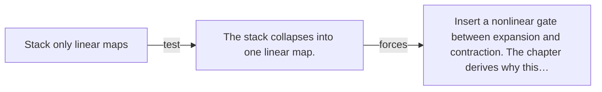

# Diagram — Excavation 012 — Feed-Forward Networks

The picture carries this excavation's particular counterexample and repair.



```text
TRY     Stack only linear maps
BREAK   The stack collapses into one linear map.
REPAIR  Insert a nonlinear gate between expansion and contraction. The chapter derives why this…
```
