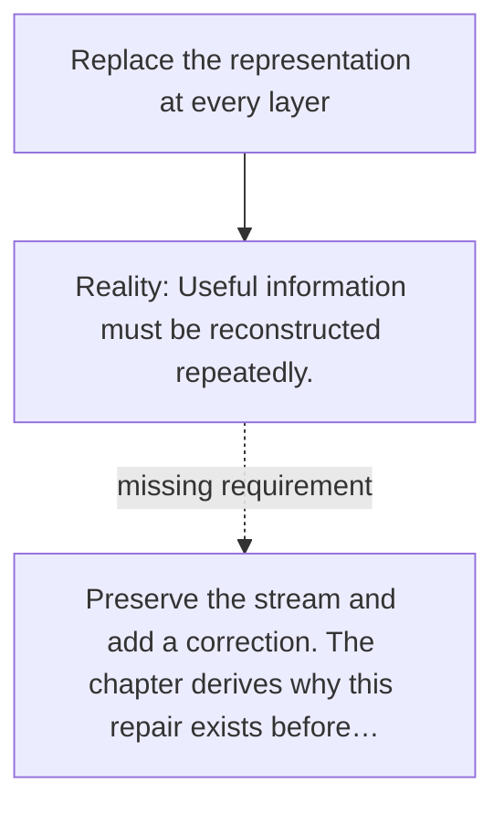

# Diagram — Excavation 013 — Residual Connections

The picture carries this excavation's particular counterexample and repair.



```text
TRY     Replace the representation at every layer
BREAK   Useful information must be reconstructed repeatedly.
REPAIR  Preserve the stream and add a correction. The chapter derives why this repair exists before…
```

<!-- memory-film-v1:start -->
## Five-frame memory film

```text
QUESTION       How can a deep stack learn a change without erasing the useful state it already has?
     ↓
OBJECT         a stone bridge with an old road running beneath a newly built arch
     ↓
VISIBLE BREAK  Every new layer replaces the whole state, so a poor transformation can destroy information and gradients struggle to return.
     ↓
TRANSFORMATION The old road remains open while the new branch contributes only its proposed change.
     ↓
MEMORY SEAL    A residual connection preserves the old state while allowing a layer to add a correction.
```
<!-- memory-film-v1:end -->
