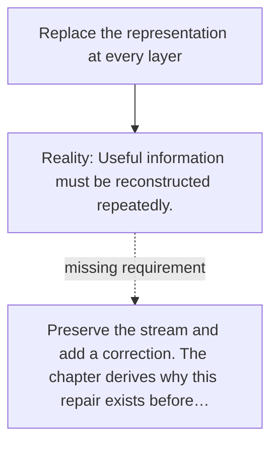

# Diagram — Excavation 013 — Residual Connections

The picture carries this excavation's particular counterexample and repair.



```text
TRY     Replace the representation at every layer
BREAK   Useful information must be reconstructed repeatedly.
REPAIR  Preserve the stream and add a correction. The chapter derives why this repair exists before…
```
