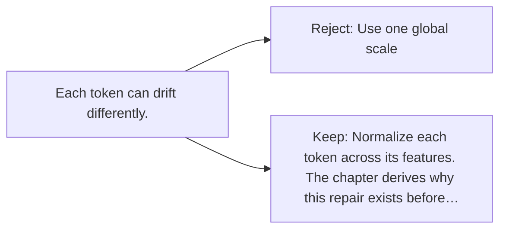

# Diagram — Excavation 014 — Layer Normalization

The picture carries this excavation's particular counterexample and repair.



```text
TRY     Use one global scale
BREAK   Each token can drift differently.
REPAIR  Normalize each token across its features. The chapter derives why this repair exists before…
```
