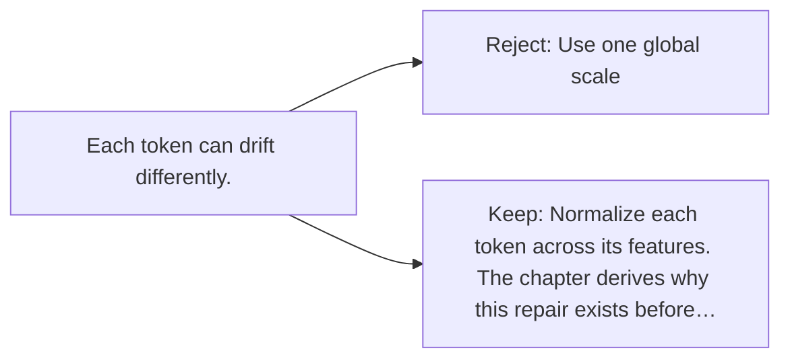

# Diagram — Excavation 014 — Layer Normalization

The picture carries this excavation's particular counterexample and repair.



```text
TRY     Use one global scale
BREAK   Each token can drift differently.
REPAIR  Normalize each token across its features. The chapter derives why this repair exists before…
```

<!-- memory-film-v1:start -->
## Five-frame memory film

```text
QUESTION       How can differently scaled hidden states enter the next layer on comparable footing?
     ↓
OBJECT         a balancing fountain whose columns begin at wildly different heights
     ↓
VISIBLE BREAK  One enormous activation dominates the chamber while tiny signals become almost invisible.
     ↓
TRANSFORMATION The fountain recenters its columns and adjusts their spread without destroying their relative pattern.
     ↓
MEMORY SEAL    Layer normalization gives each token a stable local scale from which learning can continue.
```
<!-- memory-film-v1:end -->
