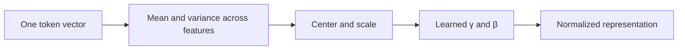

# Diagrams — Layer Normalization

```mermaid
flowchart LR
 X[One token vector] --> S[Mean and variance across features]
 S --> N[Center and scale]
 N --> L[Learned γ and β]
 L --> Y[Normalized representation]
```
