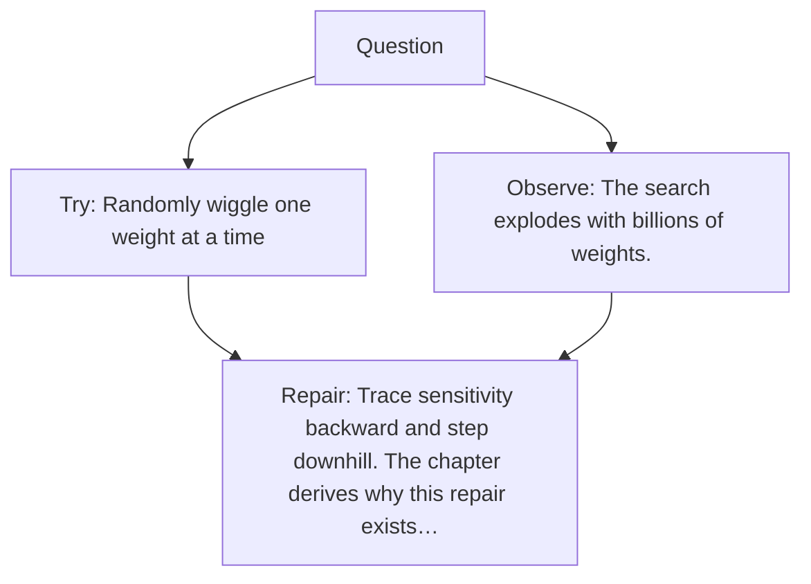

# Diagram — Excavation 015 — How a Dead Brain Learns

The picture carries this excavation's particular counterexample and repair.



```text
TRY     Randomly wiggle one weight at a time
BREAK   The search explodes with billions of weights.
REPAIR  Trace sensitivity backward and step downhill. The chapter derives why this repair exists…
```
