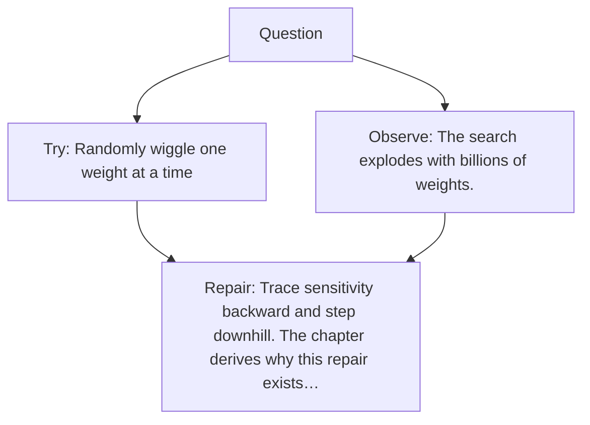

# Diagram — Excavation 015 — How a Dead Brain Learns

The picture carries this excavation's particular counterexample and repair.



```text
TRY     Randomly wiggle one weight at a time
BREAK   The search explodes with billions of weights.
REPAIR  Trace sensitivity backward and step downhill. The chapter derives why this repair exists…
```

<!-- memory-film-v1:start -->
## Five-frame memory film

```text
QUESTION       How can a machine use an error to change the internal decisions that produced it?
     ↓
OBJECT         a clay brain beside a prediction stone and an error chisel
     ↓
VISIBLE BREAK  The machine can measure that its answer was wrong but the judgment leaves no mark on its internal weights.
     ↓
TRANSFORMATION The error chisel travels backward, assigning each adjustable surface a small responsibility and reshaping it.
     ↓
MEMORY SEAL    Learning begins when observed error can alter the decisions that created it.
```
<!-- memory-film-v1:end -->
