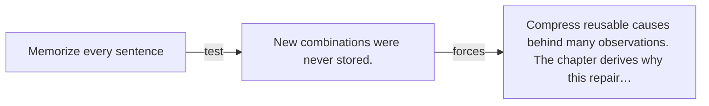

# Diagram — Excavation 016 — The Hidden World Behind Words

The picture carries this excavation's particular counterexample and repair.



```text
TRY     Memorize every sentence
BREAK   New combinations were never stored.
REPAIR  Compress reusable causes behind many observations. The chapter derives why this repair…
```
