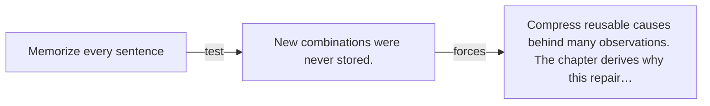

# Diagram — Excavation 016 — The Hidden World Behind Words

The picture carries this excavation's particular counterexample and repair.



```text
TRY     Memorize every sentence
BREAK   New combinations were never stored.
REPAIR  Compress reusable causes behind many observations. The chapter derives why this repair…
```

<!-- memory-film-v1:start -->
## Five-frame memory film

```text
QUESTION       How can countless small learned relationships become abilities nobody wrote as rules?
     ↓
OBJECT         a dark word-constellation whose hidden figure appears only when all stars glow
     ↓
VISIBLE BREAK  Inspecting one star or one rule reveals almost nothing resembling the complete ability.
     ↓
TRANSFORMATION Connections brighten across many layers until a larger structure becomes visible between them.
     ↓
MEMORY SEAL    Emergence is the visible capability formed by many distributed relationships acting together.
```
<!-- memory-film-v1:end -->
