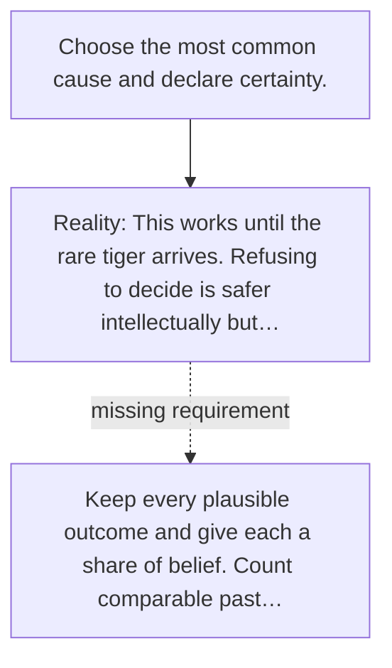

# Diagram — Excavation 017 — Probability — Counting What We Do Not Know

The picture carries this excavation's particular counterexample and repair.



```text
TRY     Choose the most common cause and declare certainty.
BREAK   This works until the rare tiger arrives. Refusing to decide is safer intellectually but…
REPAIR  Keep every plausible outcome and give each a share of belief. Count comparable past…
```
