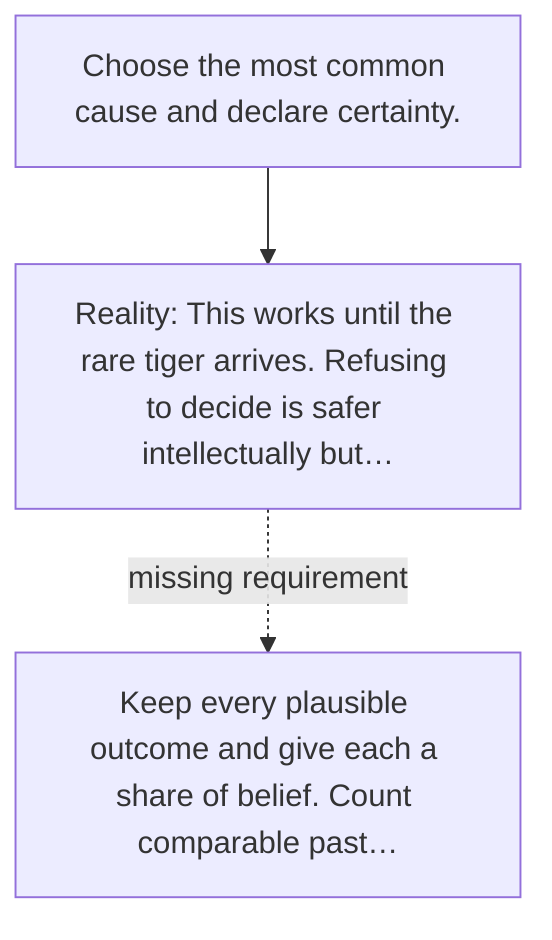

# Diagram — Excavation 017 — Probability — Counting What We Do Not Know

The picture carries this excavation's particular counterexample and repair.



```text
TRY     Choose the most common cause and declare certainty.
BREAK   This works until the rare tiger arrives. Refusing to decide is safer intellectually but…
REPAIR  Keep every plausible outcome and give each a share of belief. Count comparable past…
```

<!-- memory-film-v1:start -->
## Five-frame memory film

```text
QUESTION       What fails if we choose the most common cause and declare certainty?
     ↓
OBJECT         the probability lens mounted on the ring of glass lanterns
     ↓
VISIBLE BREAK  The lens follows the tempting path—choose the most common cause and declare certainty. Then the evidence answers: this works until the rare tiger arrives. Refusing to decide is safer intellectually but useless when the camp must act.
     ↓
TRANSFORMATION The keeper of uncertain stories changes one moving part. The lens can now keep every plausible outcome and give each a share of belief. Count comparable past observations, then divide the count for one outcome by the total.
     ↓
MEMORY SEAL    Probability keeps the missing power: keep every plausible outcome and give each a share of belief. Count comparable past observations, then divide the count for one outcome by the total.
```
<!-- memory-film-v1:end -->
