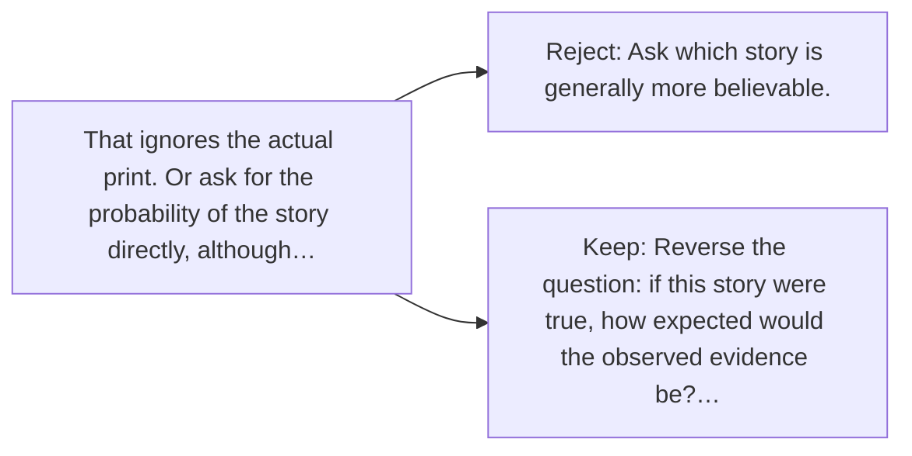

# Diagram — Excavation 018 — Likelihood — Which Hidden Story Produced This Evidence?

The picture carries this excavation's particular counterexample and repair.



```text
TRY     Ask which story is generally more believable.
BREAK   That ignores the actual print. Or ask for the probability of the story directly, although…
REPAIR  Reverse the question: if this story were true, how expected would the observed evidence be?…
```

<!-- memory-film-v1:start -->
## Five-frame memory film

```text
QUESTION       Which Hidden Story Produced This Evidence?
     ↓
OBJECT         the likelihood key mounted on the ring of glass lanterns
     ↓
VISIBLE BREAK  The key follows the tempting path—ask which story is generally more believable. Then the evidence answers: that ignores the actual print. Or ask for the probability of the story directly, although the story is what we are trying to judge.
     ↓
TRANSFORMATION The keeper of uncertain stories changes one moving part. The key can now reverse the question: if this story were true, how expected would the observed evidence be?.
     ↓
MEMORY SEAL    Likelihood keeps the missing power: reverse the question: if this story were true, how expected would the observed evidence be?.
```
<!-- memory-film-v1:end -->
