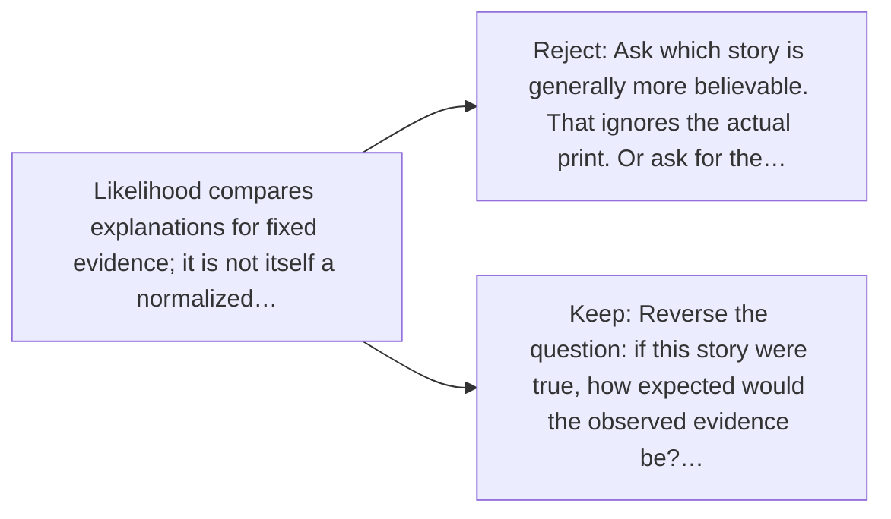

# Diagram — Excavation 018 — Likelihood — Which Hidden Story Produced This Evidence?

The picture carries this excavation's particular counterexample and repair.



```text
TRY     Ask which story is generally more believable. That ignores the actual print. Or ask for the…
BREAK   Likelihood compares explanations for fixed evidence; it is not itself a normalized…
REPAIR  Reverse the question: if this story were true, how expected would the observed evidence be?…
```
